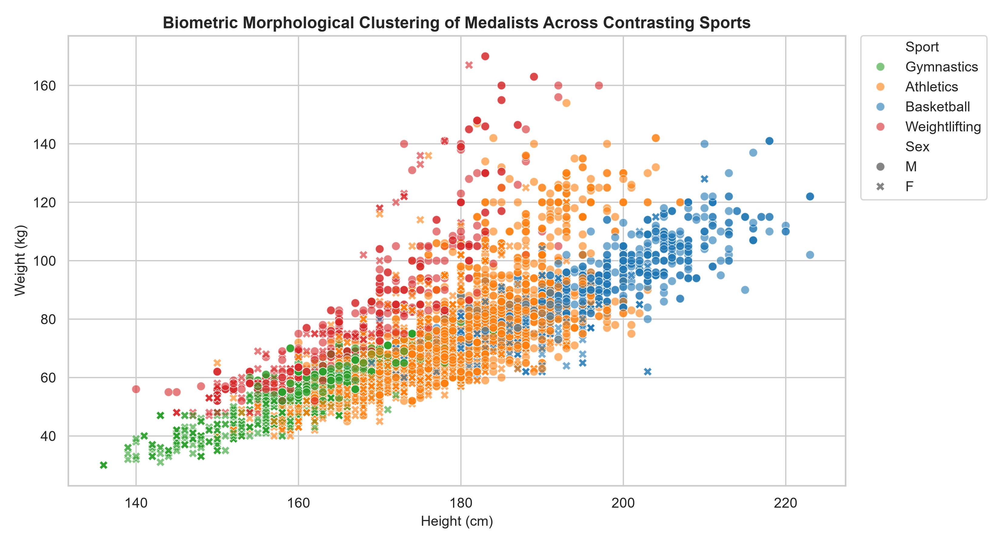
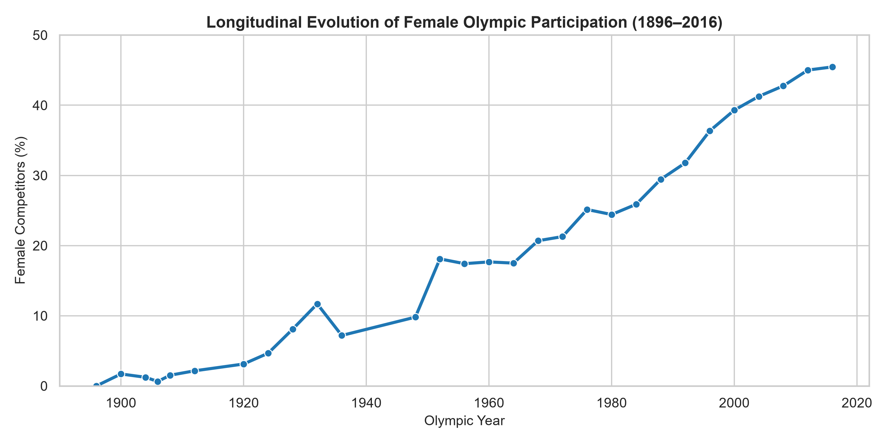

# 120 Years of Olympic History: End-to-End SQL Analytics & Performance Benchmarking

A complete relational SQL data engineering and analytics project investigating 120 years of modern Olympic competition records (1896–2016).

This project models a dual-stakeholder engagement for **SportsStats**, delivering quantitative physiological benchmarks for elite personal training academies and historical narrative packages for sports journalism media.

---

## 📌 Key Insights & Deliverables

* **Data Hygiene & Schema Verification:** Handled ~22–23% missing biometrics (height/weight) via targeted filtering and resolved orphan region key mismatches (`SGP` vs. `SIN`) using `COALESCE`.
* **Team Event Deduplication:** Isolated single-event team victories using CTEs to eliminate roster-multiplicity inflation (e.g., deduplicating the 12 gold medals awarded in 1992 Men's Basketball into 1 tournament win).
* **Biometric Clustering & Morphological Archetypes:** Dynamically computed Body Mass Index (BMI) profiles across disciplines, uncovering high-BMI leverage sports (Weightlifting avg BMI: 27.6) versus low-BMI efficiency sports (Gymnastics avg BMI: 21.2).
* **Longevity & Age Windows:** Identified peak competitive performance windows across sports, comparing early-specialization events (Swimming avg gold age: 21.7) against extended-career disciplines (Equestrian avg gold age: 35.3).
* **Longitudinal Gender Parity Analysis:** Traced female participation trends from 0% in 1896 to 44.9% in Rio 2016.
* **Host Nation Advantage:** Applied SQL moving-window functions (`AVG() OVER ROWS BETWEEN 3 PRECEDING AND 1 PRECEDING`) to quantify home-country medal surges (+15 to +42 medals above baseline).
* **Automated Executive Reporting:** Programmatically generated an executive Word report (`SportsStats_Final_Report.docx`) with embedded styles, tables, and Seaborn visual plots via `python-docx`.

---

## 📊 Visualizations

### Morphological Clustering Across Sports


### Longitudinal Evolution of Female Participation


---

## 🗄️ Relational Architecture

The database couples an event fact table with a geographic dimension table:

* **`athlete_events` (Fact Table):** 271,116 event records detailing athlete demographics, physical attributes, disciplines, and medal outcomes.
* **`noc_regions` (Dimension Table):** 230 reference records mapping National Olympic Committee codes to standardized country entities.

---

## 💻 Advanced SQL Implementations

### 1. Distinct Event-Level National Dominance (Eliminating Roster Multiplicity)
```sql
WITH DistinctEventMedals AS (
    SELECT DISTINCT 
        Year, Season, Sport, Event, Medal, NOC
    FROM athlete_events
    WHERE Medal IN ('Gold', 'Silver', 'Bronze')
)
SELECT 
    COALESCE(r.region, d.NOC) AS country,
    COUNT(CASE WHEN d.Medal = 'Gold' THEN 1 END) AS gold_events,
    COUNT(CASE WHEN d.Medal = 'Silver' THEN 1 END) AS silver_events,
    COUNT(CASE WHEN d.Medal = 'Bronze' THEN 1 END) AS bronze_events,
    COUNT(*) AS total_event_medals
FROM DistinctEventMedals d
LEFT JOIN noc_regions r ON d.NOC = r.NOC
GROUP BY COALESCE(r.region, d.NOC)
ORDER BY total_event_medals DESC
LIMIT 10;
